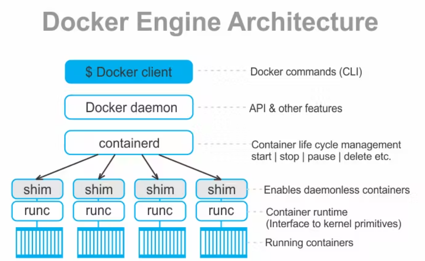

# 4. Contenedores con Docker

### 4.1.1 Definición de contenedores

Los contenedores son una forma de empaquetar, distribuir e implementar aplicaciones de software de forma rápida y eficiente. 

Un contenedor es una unidad de software que empaqueta una aplicación y todas sus dependencias, de modo que la aplicación se pueda ejecutar de forma fiable y rápida en cualquier entorno. Los contenedores aíslan el software de su entorno y garantizan que funcione de la misma manera en cualquier lugar.

Los contenedores son una solución ligera y portátil que hace que el desarrollo, la implementación y la administración de aplicaciones sean más rápidos y fáciles. Los contenedores son ideales para aplicaciones y servicios basados en microservicios, ya que permiten a los equipos de desarrollo dividir las aplicaciones en componentes más pequeños y fáciles de gestionar.

Para conocer un poco más sobre los contenedores y su historia, les recomiendo una conferencia donde se explica la historia de los contenedores y su evolución. [Conferencia](https://www.youtube.com/watch?v=cUygIN0MRUc&t=1566s)

### 4.1.2 Comparación con máquinas virtuales

Los contenedores son similares a las máquinas virtuales, pero son más ligeros y portátiles. Mientras que las máquinas virtuales emulan hardware físico, los contenedores emulan el sistema operativo del host. Esto significa que los contenedores virtualizan el sistema operativo, pero no el hardware subyacente.


En esta imagen podemos ver la diferencia entre una máquina virtual y un contenedor. 

En la máquina virtual, cada máquina virtual tiene su propio sistema operativo y su propia copia de la aplicación, todo esto a nivel de hardware. Esto nos permite tener varias sistemas operativos en un mismo hardware físico, pero con mayor consumo de recursos que quiza no se estén utilizando.

En el contenedor, estos son levantandos en un mismo sistema operativo, compartiendo el kernel del sistema operativo, lo que permite que los contenedores sean más ligeros y portátiles que las máquinas virtuales. Cada uno de los contenedores tiene su propia copia de la aplicación y sus dependencias, pero comparten el sistema operativo del host.


### 4.1.3 Beneficios de los contenedores

Con lo anterior, podemos ver que los contenedores tienen varias ventajas y beneficios sobre las máquinas virtuales y en general sobre la virtualización de sistemas. Algunos de estos beneficios son:

1. **Reduce los recursos de administración de IT**
2. **Tamaño reducido lo que permite mayor densidad**
3. **Reduce y simplifica las actualizaciones seguras**
4. **Agilidad tanto en desarollo como en producción**

## 4.2. Instalación y configuración de Docker

### 4.2.1 ¿Qué es Docker?

Docker es una plataforma de código abierto que permite a los desarrolladores empaquetar, distribuir y ejecutar aplicaciones en contenedores. Los contenedores son unidades de software que empaquetan una aplicación y todas sus dependencias, de modo que la aplicación se pueda ejecutar de forma fiable y rápida en cualquier entorno.

Docker fue lanzado en 2013 y desde entonces se ha convertido en una de las herramientas de desarrollo más populares. Docker es una solución ligera y portátil que hace que el desarrollo, la implementación y la administración de aplicaciones sean más rápidos y fáciles.

Docker no solo se encarga de la creación de contenedores, sino que viene con una serie de herramientas para el manejo de imagenes, red, volumentes, entre otros.

Tomar en cuenta que docker no es el único software que permite la creación de contenedores, pero es el más popular y el que se ha convertido en el estándar de facto en la industria. Existen otras alternativas como Podman, LXC, LXD, entre otros.

Este es el [enlace](https://www.docker.com/) de la **página oficial** de Docker.

### 4.2.2 Instalación de Docker Linux

Para instalar Docker en Linux, se recomienda seguir la documentación oficial de Docker, ya que la instalación puede variar dependiendo de la distribución de Linux que se esté utilizando.

Platform |	x86_64 / amd64
------------ | -------------
[Ubuntu](https://docs.docker.com/engine/install/ubuntu/)	 |✅
Debian	|✅
Red Hat Enterprise Linux (RHEL) |	✅
[Fedora](https://docs.docker.com/desktop/install/fedora/)	| ✅


### 4.2.3 Instalación de Docker Windows

Para instalar Docker en Windows, como tal no se instala Docker en Windows, sino que se instala Docker Desktop, que es una aplicación que permite a los desarrolladores empaquetar, distribuir y ejecutar aplicaciones en contenedores. Docker Desktop es instalar WSL 2 (Windows Subsystem for Linux) y Docker Engine.

## 4.3. Explicación del Docker Engine

### 4.3.1 Arquitectura del Docker Engine

El Docker Engine es una aplicación cliente-servidor con estos componentes:

- Un servidor que es un tipo de demonio que se ejecuta en la máquina host.
- Una API REST que especifica interfaces que los programas pueden usar para hablar con el demonio y darle instrucciones.

**¿Qué es un Deamon (demonio)?**

Un demonio es un programa que se ejecuta en segundo plano, sin interacción directa con el usuario. Los demonios se utilizan para realizar tareas de mantenimiento y administración del sistema, como la gestión de servicios, la programación de tareas y la monitorización del sistema.

En el caso de Docker, el demonio es el servidor de Docker que se ejecuta en la máquina host y se encarga de gestionar los contenedores y las imágenes de Docker.

### 4.3.2 Ciclo de vida de un contenedor

El ciclo de vida de un contenedor es administrado por un runtime de contenedores, que es un software que se encarga de ejecutar y gestionar los contenedores. Docker utiliza un runtime de contenedores llamado containerd, que es un proyecto de código abierto que proporciona una API para la gestión de contenedores.

El ciclo de vida de un contenedor consta de los siguientes pasos:

1. **Creación**: En este paso, se crea un contenedor a partir de una imagen de Docker. Una imagen de Docker es un paquete de software que contiene una aplicación y todas sus dependencias. 

2. **Inicio**: En este paso, se inicia el contenedor y se ejecuta la aplicación que contiene. 

3. **Ejecución**: En este paso, se ejecuta la aplicación que contiene el contenedor. 

4. **Detención**: En este paso, se detiene el contenedor y se detiene la aplicación que contiene.



En la imagen de arriba podemos ver la arquitectura de Docker Engine. Se divide en varias partes las cuales explicaremos a continuación:

- **Docker Client**: Es la interfaz de línea de comandos que se utiliza para interactuar con el servidor de Docker. El cliente de Docker envía comandos al servidor de Docker a través de la API REST.
- **Docker deamon**: Es el servidor de Docker que se ejecuta en la máquina host y se encarga de gestionar los contenedores y las imágenes de Docker. El demonio de Docker escucha en un socket UNIX o en un puerto TCP para recibir comandos del cliente de Docker.
- **containerd**: Es un runtime de contenedores que se encarga de ejecutar y gestionar los contenedores. Docker utiliza containerd como su runtime de contenedores. Esta ligado a el ciclo de vida que detalla arriba.
- **shim**: Es un componente que actúa como intermediario entre containerd y el contenedor. El shim se encarga de iniciar y detener el contenedor y de redirigir la entrada y la salida estándar del contenedor.
- **runc**: Es un ejecutor de contenedores que se encarga de ejecutar el contenedor. Runc es un proyecto de código abierto que proporciona una implementación de la especificación de contenedores de la Open Container Initiative (OCI).

Hay algo que debemos tomar muy en cuenta y es que existen dos tipos de runtime de contenedores.
- Los high-level runtime, como containerd, que proporcionan una API de alto nivel para la gestión de contenedores, temas de red, volúmenes, etc.
- Los low-level runtime, como runc, que proporcionan una implementación de bajo nivel utilizando los cgroups y namespaces del kernel de Linux.
  

### 4.3.3 Imágenes y contenedores

**¿Qué es una imagen de Docker?**

Una imagen de Docker **es un paquete de software** que contiene una aplicación y todas sus dependencias. Una imagen de Docker **se utiliza para crear contenedores** de Docker, que **son instancias** en ejecución de una imagen de Docker.

Usualmente estas imagenes las podemos encontrar en el [Docker Hub](https://hub.docker.com/), que es un repositorio de imágenes de Docker que se pueden utilizar para crear contenedores de Docker.


https://community.sap.com/t5/technology-blogs-by-sap/use-private-registry-for-containerize-a-cap-application-part-1/ba-p/13541667 

En esta imagen podemos observar dos flujos de como el registry, imagenes y contenedores de docker interactuan entre si.

En el primer flujo observamos como desde el registry se hace un pull a nuestra computadora de que imagen queremos utilizar, luego de esto se crea un contenedor con la imagen que se descargo.

En el segundo flujo observamos como se crea una imagen a partir de un Dockerfile, luego con este archivo se crea la imagen y se sube al registry para que otros usuarios puedan utilizarla. Por último, podemos descargar o hacer pull de la imagen que subimos al registry.

### 4.3.4 Comandos de Docker

Ahora vamos a ver de forma agrupada los comandos de Docker más utilizados. 

#### Comandos de Docker para la gestión de imágenes

- **Buscar una imagen en Docker Hub: `docker search`**
    ```bash
      # Busca una imagen en Docker Hub
      docker search ubuntu
    ```
- **Descargar una imagen de Docker Hub: `docker pull`**
    ```bash
      # Descarga una imagen de Docker Hub
      docker pull ubuntu
    ```
- **Listar imágenes de Docker: `docker images`**
    ```bash
      # Lista las imágenes de Docker
      docker images
    ```
- **Eliminar una imagen de Docker: `docker rmi`**
    ```bash
      # Elimina una imagen de Docker
      docker rmi ubuntu
      # -f: Fuerza la eliminación de una imagen
      docker rmi -f ubuntu
    ```

#### Comandos de Docker para la gestión de contenedores

- **Crear y Ejecutar un contenedor: `docker run`**
    ```bash
      # -d: Corre el contenedor en segundo plano
      # --name: Asigna un nombre al contenedor
      # ubuntu: Imagen de Docker que se va a utilizar
      docker run -d --name mi_contenedor ubuntu
    ```
- **Listar contenedores en ejecución: `docker ps`**
    ```bash
      # lista los contenedores en ejecución
      docker ps 
      # -a: Muestra todos los contenedores, incluyendo los que no están en ejecución
      docker ps -a
      # -eq: Muestra los últimos contenedores que se han ejecutado
      docker ps -eq
    ```
- **Inspeccionar un contenedor `docker inspect`**
    ```bash
      # Inspecciona un contenedor
      docker inspect mi_contenedor
    ```
- **Detener un contenedor: `docker stop`**
    ```bash
      # Detiene un contenedor
      docker stop mi_contenedor
    ```
- **Iniciar un contenedor: `docker start`**
    ```bash
      # Inicia un contenedor
      docker start mi_contenedor
    ```
- **Eliminar un contenedor: `docker rm`**
    ```bash
      # Elimina un contenedor
      docker rm mi_contenedor
      # -f: Fuerza la eliminación de un contenedor en ejecución
      docker rm -f mi_contenedor
    ```
- **Logs de un contenedor: `docker logs`**
    ```bash
      # Muestra los logs de un contenedor
      docker logs mi_contenedor
    ```
- **Ejecutar un comando en un contenedor: `docker exec`**
    ```bash
      # Ejecuta un comando en un contenedor
      docker exec mi_contenedor ls -la
    ```
- **Entrar a un contenedor: `docker exec -it`**
    ```bash
      # -it: Permite interactuar con el contenedor
      docker exec -it mi_contenedor bash
    ```

Acá pueden ver la hoja de referencia de los comandos de Docker que les dejo para que la tengan a la mano. 
- [Hoja de referencia](https://docs.docker.com/get-started/docker_cheatsheet.pdf)
- [Hoja de referencia 2](https://dockerlabs.collabnix.com/docker/cheatsheet/)

## 4.4. Dockerfile y Multistages

### 4.4.1 ¿Qué es un Dockerfile?

Un Dockerfile es un archivo de texto que contiene una serie de instrucciones que se utilizan para construir una imagen de Docker. Un Dockerfile se utiliza para automatizar el proceso de creación de imágenes de Docker y para definir cómo se debe construir una imagen de Docker.

Usualmente los Dockerfile se utilizan para definir configuraciones específicas de una aplicación, como las dependencias, las variables de entorno, los comandos de inicio, etc. 

Un Dockerfile se compone de una serie de instrucciones que se ejecutan en orden para construir una imagen de Docker. Algunas de las instrucciones más comunes de un Dockerfile son:

- **FROM**: Especifica la imagen base que se va a utilizar para construir la imagen de Docker.
- **RUN**: Ejecuta un comando en la imagen de Docker.
- **COPY**: Copia archivos desde el sistema de archivos del host a la imagen de Docker.
- **CMD**: Especifica el comando que se va a ejecutar cuando se inicie un contenedor a partir de la imagen de Docker.
- **EXPOSE**: Expone un puerto en el contenedor.
- **ENV**: Define una variable de entorno en el contenedor.

### 4.4.2 Sintaxis y estructura de un Dockerfile

Un Dockerfile se compone de una serie de instrucciones que se ejecutan en orden para construir una imagen de Docker. Cada instrucción de un Dockerfile se compone de una palabra clave y uno o más argumentos.

Ahora analizaremos un Dockerfile para la ejecución de una aplicación en Python, en este caso usando Flask.

```Dockerfile
# Usar una imagen base de Python
FROM python:3.9-slim

# Establecer el directorio de trabajo dentro del contenedor
WORKDIR /app

# Copiar el archivo de requisitos (dependencies)
COPY requirements.txt .

# Instalar las dependencias necesarias
RUN pip install --no-cache-dir -r requirements.txt

# Copiar el código de la aplicación en el contenedor
COPY . .

# Exponer el puerto en el que la aplicación va a correr
EXPOSE 5000

# Comando para ejecutar la aplicación
CMD ["python", "app.py"]

```

Ahora vamos a analizar otro Dockerfile que se encarga de construir una imagen de Docker para una aplicación en Node.js.

```Dockerfile
# Usar una imagen base de Node.js
FROM node:18-alpine

# Establecer el directorio de trabajo dentro del contenedor
WORKDIR /usr/src/app

# Copiar package.json y package-lock.json
COPY package*.json ./

# Instalar las dependencias
RUN npm install --production

# Copiar todo el código de la aplicación
COPY . .

# Compilar la aplicación para producción
RUN npm run build

# Exponer el puerto de la aplicación
EXPOSE 8080

# Comando para ejecutar la aplicación
CMD ["node", "dist/server.js"]
```
### 4.4.3 Multistage Builds

Los multistage builds son una característica de Docker que permite construir imágenes de Docker en varias etapas. Los multistage builds se utilizan para reducir el tamaño de las imágenes de Docker y para mejorar el rendimiento de la construcción de imágenes.

Ahora vamos analizar dos ejemplos de Dockerfile con multistage builds.

**El primer ejemplo** es un Dockerfile que se encarga de construir una imagen de Docker de un compilado de una aplicación en Go.

```Dockerfile
# Etapa de compilación
FROM golang:1.22rc1-bullseye AS build 

# Establecer el directorio de trabajo dentro del contenedor
WORKDIR /app

# Copiar el código de la aplicación en el contenedor
COPY go.mod go.sum ./

# Descargar las dependencias
RUN go mod download

# Copiar el código de la aplicación en el contenedor
COPY . .

# Compilar la aplicación
RUN go build \
  -ldflags="-linkmode external -extldflags -static" \
  -tags netgo \
  -o server-payment

# Etapa de producción
FROM scratch

# Copiar el binario de la aplicación de la etapa de compilación
COPY --from=build /etc/ssl/certs/ca-certificates.crt /etc/ssl/certs/
COPY --from=build /app/server-payment server-payment

# Comando para ejecutar la aplicación
CMD ["/server-payment"]
```

**El segundo ejemplo** es un Dockerfile que se encarga de construir una imagen de Docker para construir una aplicación web en React con un backend en Node.js. La primera etapa compila el frontend y la segunda prepara el backend con el frontend embebido.

```Dockerfile
# Etapa 1: Compilar el Frontend
FROM node:18-alpine as build

# Establecer el directorio de trabajo
WORKDIR /app

# Instalar dependencias y compilar el frontend
COPY frontend/package*.json ./
RUN npm install
COPY frontend/ ./
RUN npm run build

# Etapa 2: Preparar el Backend con el Frontend
FROM node:18-alpine

# Establecer el directorio de trabajo
WORKDIR /app

# Instalar dependencias del backend
COPY backend/package*.json ./
RUN npm install

# Copiar el backend
COPY backend/ ./

# Copiar el build del frontend desde la etapa 1
COPY --from=build /app/build ./public

# Exponer el puerto de la aplicación
EXPOSE 5000

# Comando para ejecutar el servidor backend
CMD ["node", "server.js"]

```

## 4.5. Network y volumenes de contenedores

### 4.5.1 Redes en Docker

### 4.5.2 Volumenes en Docker

### 4.5.3 Comandos de Docker Network y Docker Volumes

## 4.6. Docker Compose

### 4.6.1 ¿Qué es Docker Compose?

### 4.6.2 Sintaxis y estructura de un archivo docker-compose.yml

### 4.6.3 Comandos de Docker Compose