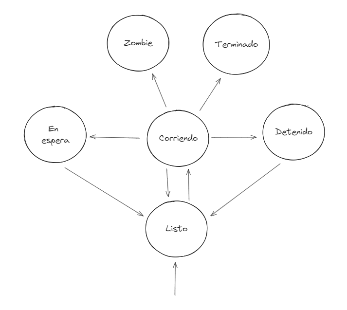
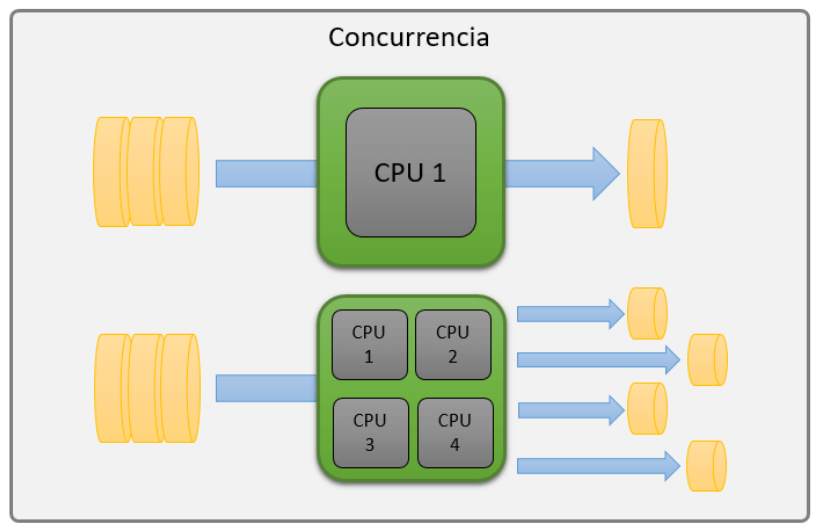
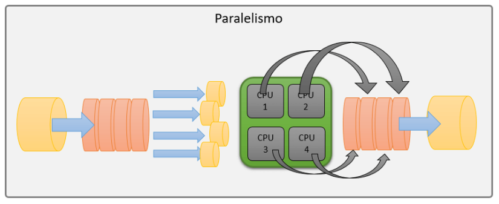

# 3. Procesos y Programación concurrente

## 3.1. Instalación/configuración de C y python en Linux

**¿Por qué instalar C o verificar su instalación?** Linux esta escrito en C, por lo que la mayoría de las herramientas y utilidades en Linux están escritas en este lenguaje, por lo tanto, es importante tener instalado un compilador de C en Linux para poder compilar programas.

C y Python usualmente son lenguajes que ya vienen instalados en la mayoría de las distribuciones de Linux, sin embargo, es importante verificar que estén instalados y en caso de no estarlo, instalarlos.

### 3.1.1. Instalación de C

Para instalar C en Linux, se debe instalar el compilador de C, `gcc`. Para instalar `gcc` en Ubuntu o Fedora, se debe ejecutar el siguiente comando:

```bash
sudo apt-get/dnf install gcc

# ver versión
gcc --version
```

Además, se puede instalar `make` para facilitar la compilación de programas en C. Para instalar `make` en Ubuntu, se debe ejecutar el siguiente comando:

```bash
sudo apt-get install make
```

También será necesario instalar los essentials de desarrollo en Ubuntu, los essentials de desarrollo incluyen herramientas y bibliotecas necesarias para compilar programas en C, para ello se debe ejecutar el siguiente comando:

```bash
sudo apt-get install build-essential
```

### 3.1.2. Instalación de Python

Python usualmente viene instalado en la mayoría de las distribuciones de Linux, sin embargo, se puede verificar si está instalado ejecutando el siguiente comando:

```bash
python --version
```

En caso de que no esté instalado, se puede instalar Python en Ubuntu o Fedora ejecutando el siguiente comando:

```bash
sudo apt-get/dnf install python3
```

## 3.2. Manejo de procesos en Linux

### Introducción a los procesos en Linux

#### ¿Qué son los procesos en linux?

Los procesos en Linux son instancias de programas en ejecución, cada proceso tiene un identificador único llamado PID (Process IDentifier) que lo identifica en el sistema. Los procesos en Linux se crean a partir de la ejecución de un programa, cada proceso tiene un estado que puede ser ejecutándose, suspendido, detenido, etc.

**¿Qué ocurre cuando se ejecuta un programa?** Cuando se ejecuta un programa en Linux, el kernel crea un proceso para ese programa, el proceso creado es una instancia del programa en ejecución, el proceso tiene su propio espacio de memoria, su propio estado y su propio PID.

#### Jerarquía de procesos en Linux

En Linux, los procesos se organizan en una jerarquía, en la que cada proceso tiene un padre y puede tener uno o varios hijos. El proceso raíz de la jerarquía de procesos en Linux es el proceso init, el proceso init es el primer proceso que se ejecuta en el sistema y es el padre de todos los demás procesos.

#### Hilos en Linux

En Linux, los hilos son procesos ligeros que comparten el mismo espacio de memoria y recursos que el proceso padre, los hilos son útiles para realizar tareas concurrentes en un programa. Los hilos en Linux se crean a partir de la llamada al sistema `clone()`.

Linux no proporciona estructuras de datos de hilos ni opciones de
programación específicas. Para el Kernel de Linux, un hilo es un proceso.

### Comandos básicos para la gestión de procesos

#### Comandos `ps` , `top`, `htop` y `pgrep`

El comando `ps` se utiliza para ver información sobre los procesos en ejecución en el sistema, el comando `ps` muestra información como el PID, el estado, el uso de CPU, el uso de memoria, etc.

El comando `top` muestra información en tiempo real sobre los procesos en ejecución en el sistema, el comando `top` muestra información como el PID, el estado, el uso de CPU, el uso de memoria, etc.

El comando `htop` es similar al comando `top`, pero tiene una interfaz gráfica más amigable y fácil de usar. Muchas distribuciones de Linux no tienen el comando `htop` instalado por defecto, pero se puede instalar ejecutando el siguiente comando:

```bash
sudo apt-get/dnf install htop
```

El comando `pgrep` se utiliza para buscar procesos por nombre o por PID, el comando `pgrep` muestra el PID de los procesos que coinciden con el nombre especificado.

#### Comandos `kill` , `pkill` y `killall`

El comando `kill` se utiliza para enviar señales a procesos en Linux, el comando `kill` envía la señal especificada al proceso con el PID especificado.

El comando `pkill` se utiliza para enviar señales a procesos por nombre, el comando `pkill` envía la señal especificada a los procesos que coinciden con el nombre especificado.

El comando `killall` se utiliza para enviar señales a procesos por nombre, el comando `killall` envía la señal especificada a los procesos que coinciden con el nombre especificado.

### Creación y finalización de procesos

#### Creación de procesos en Linux

En Linux, los procesos se crean a partir de la llamada al sistema `fork()`, la llamada al sistema `fork()` crea un proceso hijo que es una copia exacta del proceso padre, el proceso hijo tiene su propio espacio de memoria, su propio estado y su propio PID.

El comando `exec()` se utiliza para reemplazar el código del proceso hijo con un nuevo código, el comando `exec()` se utiliza para ejecutar un nuevo programa en el proceso hijo.

El proceso hijo creado a partir de la llamada al sistema `fork()` tiene un PID diferente al del proceso padre, el PID del proceso hijo es diferente al PID del proceso padre.

Antes de continuar con la creación de procesos es importante tener en mente que es una señal y como se manejan en Linux.

#### Señales en Linux

Las señales en Linux son eventos que se utilizan para notificar a un proceso de que ha ocurrido un evento, las señales se utilizan para manejar eventos como la finalización de un proceso, la interrupción de un proceso, etc.

Las señales en Linux se identifican por un número entero, cada señal tiene un número entero asociado que se utiliza para identificarla. Algunas señales comunes en Linux son:

- SIGKILL: Señal que se utiliza para matar un proceso.
- SIGTERM: Señal que se utiliza para terminar un proceso.
- SIGINT: Señal que se utiliza para interrumpir un proceso.
- SIGSTOP: Señal que se utiliza para detener un proceso.
- SIGCONT: Señal que se utiliza para continuar un proceso detenido.
- SIGUSR1: Señal que se utiliza para enviar una señal personalizada a un proceso.
- SIGCHLD: Señal que se utiliza para notificar a un proceso padre que un proceso hijo ha terminado.
- SIGQUIT: Señal que se utiliza para notificar a un proceso que ha ocurrido un error de salida.

También los procesos se pueden ejecutar utilizando la combinación de teclas, por ejemplo, `Ctrl + C` envía la señal `SIGINT` al proceso en ejecución, `Ctrl + Z` envía la señal `SIGSTOP` al proceso en ejecución.


### Ejemplos

1. **Ver información de procesos**
   A continuación una lista de comandos con sus flags para ver información de procesos en Linux:

   ```bash
    ps # muestra información de los procesos en ejecución
    ps aux # muestra información detallada de los procesos en ejecución
    ps -ef # muestra información detallada de los procesos en ejecución
    ps -axjf # muestra información detallada de los procesos en ejecución
   ```

   Comando **top**
  
   ```bash
    top # muestra información en tiempo real de los procesos en ejecución
   ```

    Comando **htop**
    
    ```bash
      htop # muestra información en tiempo real de los procesos en ejecución
    ```

    Comando **pgrep**
    
    ```bash
      pgrep nombre_proceso # muestra el PID de los procesos que coinciden con el nombre especificado
    ```

2. **Crear y matar procesos**
  Ahora vamos a crear un script en la bash que inicie un proceso en segundo plano y luego lo mate después de un tiempo determinado.

    ```bash
   #!/bin/bash
   sleep 100 & # Inicia un proceso en segundo plano que duerme durante 100 segundos
   PID=$! # Guarda el PID del proceso en segundo plano en la variable PID
   echo "El PID del proceso en segundo plano es: $PID" # Imprime el PID del proceso
   sleep 10 # Espera 10 segundos
   kill $PID # Mata el proceso en segundo plano usando el PID guardado en la variable
   echo "Proceso terminado" # Imprime un mensaje indicando que el proceso ha sido terminado
    ```

    Para poder visualizar el proceso en ejecución, se puede utilizar el comando `ps` o `top` para ver el proceso en ejecución.
    

3. **Manejo de señales en C**
  Vamos a escribir un programa en C que maneje señales como las que se vio anteriormente.

    ```c
    #include <stdio.h> # incluye la biblioteca estándar de entrada y salida
    #include <stdlib.h> # incluye la biblioteca estándar
    #include <signal.h> # incluye la biblioteca de señales
    #include <unistd.h> # incluye la biblioteca de llamadas al sistema

    void manejar_senal(int sig) {
      printf("Señal recibida: %d\n", sig); # imprime el número de la señal recibida
      exit(1); # termina el programa, el 1 indica que el programa terminó con error
    }

    int main() {
      signal(SIGINT, manejar_senal); # maneja la señal SIGINT
      while(1) {
        printf("Esperando señal...\n"); # imprime un mensaje
        sleep(1); # espera 1 segundo
      }

      return 0; # termina el programa, el 0 indica que el programa terminó sin error
    }
    ```
## 3.3. Diagrama de transición de procesos

### Estados de los procesos

Los procesos en Linux pueden estar en diferentes estados, los estados de los procesos en Linux son:

- **Listo**: El proceso está listo para ejecutarse y está esperando a que el planificador de procesos le asigne la CPU.
- **Corriendo**: El proceso está en ejecución y está utilizando la CPU.
- **En espera**: El proceso está en espera y está esperando a que ocurra un evento. 
- **Detenido**: El proceso ha sido detenido mediante el envío de alguna señal.
- **Zombie**: El proceso ha terminado de ejecutarse, pero su entrada en la tabla de procesos aún no ha sido eliminada.
- **Terminado**: El proceso ha terminado de ejecutarse y ha liberado todos los recursos que estaba utilizando.

### Transiciones de estados

Los procesos en Linux pueden cambiar de estado a lo largo de su vida, los procesos pueden cambiar de estado por diferentes razones, como la finalización de un proceso, la interrupción de un proceso, etc.

Las transiciones de estados de los procesos en Linux son:

- **Listo -> Corriendo/Ejecución**: El proceso pasa de estar listo a estar en ejecución.
- **Ejecución -> En espera/Detenido**: El proceso pasa de estar en ejecución a estar en espera o detenido.
- **Ejecución -> Zombie**: El proceso pasa de estar en ejecución a estar en estado zombie.
- **Espera -> Listo**: El proceso pasa de estar en espera a estar listo.

### Colas de procesos y planificación (scheduling)

En Linux, los procesos se organizan en colas de procesos, las colas de procesos se utilizan para organizar los procesos en función de su prioridad y de su estado. Las colas de procesos en Linux son:

- **Cola de procesos de usuario**: Cola de procesos que contiene los procesos de usuario.
- **Cola de procesos del sistema**: Cola de procesos que contiene los procesos del sistema.

El planificador de procesos en Linux se encarga de asignar la CPU a los procesos en función de su prioridad y de su estado, el planificador de procesos en Linux se encarga de organizar los procesos en las colas de procesos y de asignar la CPU a los procesos en función de su prioridad y de su estado.

#### Algoritmos de planificación

En Linux, el planificador de procesos utiliza diferentes algoritmos de planificación para asignar la CPU a los procesos, los algoritmos de planificación de procesos en Linux son:

- **First-Come, First-Served (FCFS)**: El planificador asigna la CPU al primer proceso que llega.
- **Shortest Job Next (SJN)**: El planificador asigna la CPU al proceso con el menor tiempo de ejecución.
- **Round Robin (RR)**: El planificador asigna la CPU a los procesos en función de un quantum de tiempo.
- **Priority Scheduling**: El planificador asigna la CPU a los procesos en función de su prioridad.


### Ejemplos

1. **Diagrama de transición de procesos**
  

2. **Ver los estados de los procesos y ver como esta funcionando el scheduling**
   
   Comando para ver los estados de los procesos en Linux:

   ```bash
    ps -axjf # fax 
   ```

    Comando para ver el planificador de procesos en Linux:
  
    ```bash
      cat /proc/sys/kernel/sched
    ```

3. **Simulación de transiciones de estados**
   

## 3.4. Programación concurrente en Linux

### Introducción a la programación concurrente

#### ¿Qué es la programación concurrente?

La programación concurrente es un paradigma de programación en el que se ejecutan múltiples tareas de forma simultánea, la programación concurrente se utiliza para realizar tareas concurrentes en un programa.

La programación concurrente permite desarrollar software que ejecute eventos o circunstancias que están sucediendo al mismo tiempo. Los módulos concurrentes interactúan enviándose mensajes entre sí. 

#### ¿Por qué es importante la programación concurrente?

La programación concurrente es importante para mejorar la eficiencia de los recursos y maximizar el rendimiento en sistemas multiprocesador.

Los procesadores de hoy en día tienen múltiples núcleos y múltiples hilos, lo que favorece notablemente este tipo de programación.

#### Diferencia con el paralelismo

La concurrencia dependiendo de los números de nucleos que tenga el procesador puede ser ejecutar tareas de manera simultanea y de forma independiente. Mientras que el paralelimos va de la mano, la idea es dividir una misma tarea en sub-tareas con la finalidad de que se ejecuten de manera simultanea pero que al final se unan para formar una sola tarea. De esta manera el resultado final del paralelismo si importa mientras que en la concurrencia no.





### Herramientas y tecnicas de concurrencia en Linux

En linux se pueden utilizar diferentes herramientas y técnicas para programar de manera concurrente, algunas de las herramientas y técnicas más comunes son:

- **Hilos**: Los hilos son procesos ligeros que comparten el mismo espacio de memoria y recursos que el proceso padre, los hilos son útiles para realizar tareas concurrentes en un programa. En C se pueden crear hilos utilizando la biblioteca `pthread.h`, la biblioteca `pthread.h` proporciona funciones y estructuras de datos para crear y gestionar hilos en un programa.

- **Mutex**: Los mutex son semáforos binarios que se utilizan para sincronizar el acceso a recursos compartidos entre hilos, los mutex se utilizan para evitar condiciones de carrera en un programa.

### Problemas clásicos de concurrencia 

#### Condiciones de carrera

Las condiciones de carrera son situaciones en las que dos o más hilos intentan acceder a un recurso compartido al mismo tiempo, las condiciones de carrera pueden causar problemas como la corrupción de datos, la pérdida de datos, etc.

#### Deadlock

El deadlock es una situación en la que dos o más hilos están esperando a que el otro libere un recurso, el deadlock puede causar que los hilos se bloqueen y no puedan continuar con su ejecución.

#### Starvation

El starvation es una situación en la que un hilo no puede acceder a un recurso compartido porque otros hilos tienen prioridad sobre él, el starvation puede causar que un hilo no pueda continuar con su ejecución.


### Ejemplos

1. **Crear hilos en C**
  ```c
  #include <stdio.h>
  #include <stdlib.h>
  #include <pthread.h> // pthread library la que contiene las funciones para trabajar con hilos


  /* 
      Esta función es la que se ejecutará en cada hilo.
      void* : significa que la función puede devolver cualquier tipo de dato.
      Recibe un argumento de tipo void* que es un apuntador a cualquier tipo de dato.
  */

  void* funcion_hilo(void* arg) {

      printf("Hola desde el hilo %ld\n", (long)arg); // imprime el id del hilo

      pthread_exit(NULL); // termina el hilo
  } 

  /* 
      Funcion con hilos más compleja. Ejecuta un loop de 100000000 iteraciones en cada hilo.
  */

  void* funcion_hilo_compleja(void* arg) {

      for (int i = 0; i < 100000000; i++) {}

      printf("Hola desde el hilo complejo %ld\n", (long)arg); // imprime el id del hilo

      pthread_exit(NULL); // termina el hilo
  }


  /* 
      Esta función es la que se ejecutará cada vez que se itere el loop
  */
  void function_secuencial(int i) {
      printf("Hola desde la función secuencial %d\n", i); // imprime el valor de i
  }

  /* 
      Esta función es la que se ejecutará cada vez que se itere el loop
  */

  void function_secuencial_compleja(int i) {
      for (int i = 0; i < 100000000; i++) {}

      printf("Hola desde la función compleja secuencial %d\n", i); // imprime el valor de i
  }

  int main() {

      // tomar tiempo desde que inicia
      clock_t start = clock();

      pthread_t threads[5]; // declara un arreglo de 5 hilos

      for (long i = 0; i < 5; i++) {
          /* 
              pthread_create recibe 4 argumentos:
              1. Un apuntador a la variable pthread_t donde se guardará el id del hilo.
              2. Un apuntador a la estructura de atributos del hilo. NULL si se quiere usar los valores por defecto.
              3. La función que se ejecutará en el hilo.
              4. El argumento que se le pasará a la función.
          */
          pthread_create(&threads[i], NULL, funcion_hilo_compleja, (void*)i); // crea un hilo y le pasa la función a ejecutar

      }

      for (long i = 0; i < 5; i++) {
          /* 
              pthread_join recibe 2 argumentos:
              1. El id del hilo que se quiere esperar.
              2. Un apuntador a la variable donde se guardará el valor de retorno de la función.

              ¿Qué pasa si no se llama a pthread_join?
              Si no se llama a pthread_join, el hilo seguirá ejecutándose en segundo plano y no se liberarán los recursos que utiliza.
          */
          pthread_join(threads[i], NULL); // espera a que el hilo termine
      }

      // tomar tiempo desde que termina
      clock_t end = clock();

      double time_spent = (double)(end - start) / CLOCKS_PER_SEC; // calcula el tiempo que tardó en ejecutarse

      printf("Tiempo de ejecución usando hilos fue: %f\n", time_spent); // imprime el tiempo de ejecución


      // iniciar otro tiempo
      start = clock();

      for (int i = 0; i < 5; i++) {
          function_secuencial_compleja(i); // llama a la función secuencial
      }

      // tomar tiempo desde que termina
      end = clock();

      time_spent = (double)(end - start) / CLOCKS_PER_SEC; // calcula el tiempo que tardó en ejecutarse

      printf("Tiempo de ejecución secuencial fue: %f\n", time_spent); // imprime el tiempo de ejecución


      /* 
          Vemos que el tiempo de ejecución usando hilos es mayor que el tiempo de ejecución secuencial.

          ¿Por qué?

          Porque el tiempo que tarda en crear y esperar a los hilos es mayor que el tiempo que se ahorra al ejecutar las funciones secuencialmente.    

      */

      return 0; // termina el programa
  }

  ```
2. **Sincronización con Mutex**
  ```c
  # include <stdio.h>
  # include <stdlib.h>
  # include <pthread.h>

  /* 
      Creamos dos variables globales:
      - contador: que será incrementada por los hilos.
      - mutex: que será usada para proteger la variable contador.
  */

  int contador = 0 ;
  pthread_mutex_t mutex ;

  /* 
      Esta función es la que se ejecutará en cada hilo.
      void* : significa que la función puede devolver cualquier tipo de dato.
      Recibe un argumento de tipo void* que es un apuntador a cualquier tipo de dato.

      Dentro de la función se ejecuta un for loop de 1000000 iteraciones.

      En cada iteración se incrementa la variable global contador.
      Pero antes de incrementarla, se bloquea el mutex con pthread_mutex_lock.
      Después de incrementarla, se desbloquea el mutex con pthread_mutex_unlock.

      Lo que hace el mutex es asegurar que solo un hilo a la vez pueda incrementar la variable contador.
      lock y unlock son funciones atómicas, es decir, no pueden ser interrumpidas por otro hilo.

      Al final de la función se llama a pthread_exit(NULL) para terminar el hilo.

      ¿Qué pasaría si no se usara el mutex?
      - Si no se usara el mutex, los hilos podrían incrementar la variable contador al mismo tiempo.
      - Esto podría llevar a que el valor de contador no sea el esperado.
  */

  void* incrementar(void *arg) {
      for (int i = 0; i < 1000000; i++) {
          pthread_mutex_lock(&mutex);
          contador++;
          pthread_mutex_unlock(&mutex);
      }

      pthread_exit(NULL);
  }


  /* 
      En la función main se crean dos hilos con pthread_create.
      Ambos hilos ejecutarán la función incrementar.
      Después de crear los hilos, se espera a que terminen con pthread_join.

      Al final se destruye el mutex con pthread_mutex_destroy y se imprime el valor de contador.
  */

  int main() {
      pthread_t thread1, thread2;

      pthread_mutex_init(&mutex, NULL); // Inicializamos el mutex 

      pthread_create(&thread1, NULL, incrementar, NULL);
      pthread_create(&thread2, NULL, incrementar, NULL);

      pthread_join(thread1, NULL);
      pthread_join(thread2, NULL);

      pthread_mutex_destroy(&mutex); // Destruimos el mutex

      printf("El contador es: %d\n", contador);


      return 0;
  }
  ```
