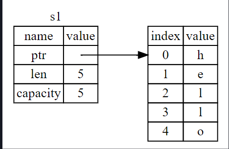
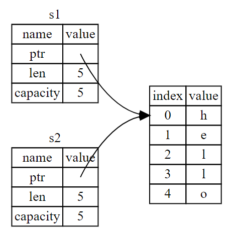

# 5. Rust


## 1.5.1. Instalación de Rust

Siempre es bueno seguir lo que la [documentacion oficial de Rust dicta](https://www.rust-lang.org/tools/install). Pero en este caso la instalación de Rust para Linux es muy sencilla y únicamente se necesitan estos comandos.

```bash
curl --proto '=https' --tlsv1.2 -sSf https://sh.rustup.rs | sh
```

Este comando aparte de instalar Rust, instala Rustup es como el administrador no solo del lenguaje sino de otras herramientas, como las del compilado, documentación y manejo de crates.

Para verificar que se haya instalado todo correctamente vamos a correr los siguientes comandos.

```bash
rustc --version
```

Si por alguna razón no llegara a funcionar este comando, seguramente es que no se agregaron al PATH. Para gestionar ese tema les recomiendo seguir la [documentación de instalación del PATH](https://doc.rust-lang.org/book/ch01-01-installation.html)

## 1.5.2. Conceptos básicos de Rust

### Introducción a Rust

- **Historia y evolución**
  - Rust fue desarrollado por Mozilla Research, con el primer lanzamiento estable en 2015.
  - Se diseñó para abordar problemas de memoria y concurrencia que son comunes en lenguajes como C y C++.
- **Propósito y filosofía del lenguaje**
  - Rust se centra en la seguridad, velocidad y concurrencia.
  - Busca ofrecer un sistema de tipos que prevenga errores de memoria y condiciones de carrera sin necesidad de un recolector de basura.

### Inicio de un proyecto en Rust

Existen dos maneras de poder compilar código en Rust, la más sencilla es crear un archivo con la extensión `.rs` y luego ejecutar el comando `rustc main.rs`.

La segunda manera y la recomendada es utilizar **Cargo**, cargo es el manejador de paquetes en Rust, muchos de los **Rustaceans** usan esta herramienta para manejar sus paquetes propios como de terceros. Usualmente cargo ya viene instalado, para validar debemos escribir esto en la consola:

```bash
cargo --version
```

**Para iniciar un proyecto de rust solo basta con escribir el siguiente comando**

```bash
cargo new hello_cargo
cd hello_cargo
```

La estructura que maneja cargo es la siguiente:

```bash
hello_cargo
├── Cargo.toml
└── src
    └── main.rs
```

`Cargo.toml` es el archivo de configuración de nuestro proyecto, en el se especifican las dependencias y la información del proyecto.

`src/main.rs` es el archivo principal de nuestro proyecto, en el se escribe el código de nuestro programa.

**Con esto en mente**, ya podemos comenzar con conceptos básicos de Rust.

### Sintaxis básica

- **Variables y constantes**
  - Las variables en Rust son inmutables por defecto y se declaran con `let`.
  - Se puede hacer una variable mutable con `mut`.
  - Las constantes se declaran con `const` y deben tener un tipo explícito.

    ```rust
    let x = 5;
    let mut y = 10;
    const MAX_POINTS: u32 = 100_000;
    ```

- **Tipos de datos primitivos**: Rust maneja una gran variedad de primitivos de los cuales son:
- **Enteros con signo (signed)**: i8, i16, i32, i64, i128, isize
- **Enteros sin signo (unsigned)**: u8, u16, u32, u64, u128, usize
- **Punto flotante**: f32, f64
- **Booleano**: bool
- **Carácter**: char
- **Compuestos**: tuplas y arreglos

    ```rust
    let tup: (i32, f64, u8) = (500, 6.4, 1);
    let arr = [1, 2, 3, 4, 5];
    ```
- **Arrays y Slices**: Los arrays son de tamaño fijo y los slices son una vista de un array.

    ```rust
    let arr: [i32; 5] = [1, 2, 3, 4, 5]; // Array de 5 elementos
    let slice = &arr[1..3];
    ```
- **Strings**: Rust maneja strings de dos formas: String y &str. Los strings son UTF-8 válidos y se pueden crear de varias formas. Mientras que &str es un slice de un string. Los String son mutables y los &str son inmutables. Eso quiere decir que los String se guardan en el heap y los &str en el stack.

    ```rust
    let s1 = String::from("hello");
    let s2 = "world";
    let s3 = format!("{} {}", s1, s2);
    let s4: &str = &s1;
    ```
- **Structs**: Los structs son tipos de datos personalizados que permiten agrupar datos de diferentes tipos.

    ```rust
    struct User {
        username: String,
        email: String,
        sign_in_count: u64,
        active: bool,
    }

    fn main() {
        let user1 = User {
            username: String::from("user1"),
            email: String::from("prueba@gmail.com"),
            sign_in_count: 1,
            active: true,
        };
    }
    ```
- **Enums**: Los enums permiten definir un tipo que puede ser uno de varios valores. Otra forma de entender los enums son las variantes que puede llegar a tener un tipo.

    ```rust
    enum IpAddrKind {
        V4,
        V6,
    }

    struct IpAddr {
        kind: IpAddrKind,
        address: String,
    }

    fn main() {
        let four = IpAddrKind::V4;
        let six = IpAddrKind::V6;

        let home = IpAddr {
            kind: IpAddrKind::V4,
            address: String::from("127.0.0.1"),
        };

        let loopback = IpAddr {
            kind: IpAddrKind::V6,
            address: String::from("::1"),
        };
    }
    ```

### Control de flujo
- **Condicionales**
   - Uso de if, else if, y else

    ```rust
    let number = 6;
    if number % 4 == 0 {
        println!("number is divisible by 4");
    } else if number % 3 == 0 {
        println!("number is divisible by 3");
    } else {
        println!("number is not divisible by 4, 3, or 2");
    }
    ```

- **Bucles**
   - loop: Ejecuta un bloque de código repetidamente hasta que se interrumpa con break.
   - while: Ejecuta un bloque de código mientras una condición sea verdadera.
   - for: Itera sobre una colección de elementos.

    ```rust
    let mut count = 0;
    loop {
        count += 1;
        if count == 3 {
            break;
        }
    }

    while count != 0 {
        count -= 1;
    }

    for number in 1..4 {
        println!("{}", number);
    }
    ```

### Funciones
- **Definición y llamada a funciones**
  - Las funciones se definen con fn.
  - En Rust se maneja el concepto de snake_case para nombrar funciones y variables.

    ```rust
    fn main() {
        say_hello();
    }

    fn say_hello() {
        println!("Hello!");
    }
    ```
- **Parámetros y retorno de valores**
   - Las funciones pueden recibir parámetros y devolver valores.
   - El tipo de retorno se especifica con ->.
   - Muchas funciones en Rust pueden o no manejar la palabra reservada return. Con Rust se puede omitir el return.
        ```rust
        fn main() {
            let result = add(5, 3);
            println!("Result: {}", result);
        }

        fn add(x: i32, y: i32) -> i32 {
            x + y
        }
        ```


## 1.5.3 Conceptos avanzados 


### Ownership

Rust es un lenguaje muy especial ya que cuentan con características únicas como es el Ownership. Pero antes de explicar que es el Ownership, es importante entender como otros lenguajes manejan la memoria.

- **Manejo de memoria en otros lenguajes**
  - **C**: En C se maneja la memoria de forma manual, se debe liberar la memoria manualmente.
  - **C++**: En C++ se maneja la memoria de forma manual, pero se pueden usar punteros inteligentes.
  - **Java, C#, Python**: Estos lenguajes cuentan con un recolector de basura que se encarga de liberar la memoria.

Una forma sencilla de entender como el Garbage Collector funciona es que se encarga de liberar la memoria que ya no se necesita. Pero en Rust no se cuenta con un recolector de basura, en su lugar se cuenta con Ownership.

**Entiendiendo Ownership**

Con el uso de este concepto, hace que Rust sea un lenguaje seguro y rápido sin la necesidad de un GC.

**Reglas de Ownership**
- Cada valor en Rust tiene una variable que es su dueño.
- Solo puede haber un dueño a la vez.
- Cuando el dueño sale del alcance, el valor se libera.

Con esto en mente vamos a ver un ejemplo de como se maneja la memoria en Rust.

```rust
fn main() {
    {                    // s no es válido aquí, no está declarado todavía
        let s = String::from("hello");   // s es válido desde este punto
    }                   // s ya no es válido

}
```

Cosas a tomar en cuenta acá es que cuando s sale del alcance, Rust se encarga de liberar la memoria. Esto se hace con un concepto llamado Drop, que se encarga de liberar la memoria. Rust lo que hace en esta parte es que una vez deja de ser válida, se libera memoria.

Por ejemplo, si usualmente cuando vemos esto

```rust
let x = 5;
let y = x;
```

Lo que muchos lenguajes y Rust hacen es que se copia el valor de x a y. Esto es posible porque estamos hablando de un tipo primitivo estatico que se encuentra en el stack. Pero si hablamos de un tipo compuesto como un String, Rust no copia el valor, sino que mueve la referencia a la memoria.

```rust
let s1 = String::from("hello");
let s2 = s1;
```

En esta figura, podemos ver lo que realmente Rust hace, en el Stack almacenamos información de S1 como el puntero, la longitud y la capacitdad. Y en el Heap almacenamos el valor de "hello". 


Entonces cuando nosotros hacemos el `let s2 = s1`, s2 ahora apunta al mismo puntero que S1.



Pero si nos damos cuenta esto va a provocar un error, ya que tendriamos lo que se conoce como un double free. **Para evitar esto Rust invalida a S1, es decir, S1 ya no es válida.**

Rust lo que nos dice ahora es que se realizo un movimiento de la memoria, es decir, S1 ya no es válida y S2 es la que tiene la referencia a la memoria.


**Funciones y Ownership**

El mecanismo es muy similar a lo que vimos anteriormente, cuando pasamos un valor a una función, Rust mueve la referencia a la memoria.

```rust
fn main() {
    let s = String::from("hello");  // s entra en el ámbito

    takes_ownership(s);             // S es movido dentro de la función
                                    // s ya no es válido aquí

    let x = 5;                      // x entra en el ámbito

    makes_copy(x);                  // x se copia dentro de la función
                                    // x sigue siendo válido aquí porque i32 es Copy

} // Here, x goes out of scope, then s. But because s's value was moved, nothing
  // special happens.

fn takes_ownership(some_string: String) { // some_string entra en el ámbito
    println!("{some_string}");
} // Aquí, some_string sale del alcance y `drop` es llamado. El espacio en memoria es liberado.

fn makes_copy(some_integer: i32) { // some_integer entra en el ámbito
    println!("{some_integer}");
} // Aquí, some_integer sale del alcance. Nada especial sucede.
```

**Retorno de valores**

Cuando una función retorna un valor, Rust también mueve la referencia a la memoria.

```rust
fn main() {
    let s1 = gives_ownership();         // gives_ownership mueve su valor a s1

    let s2 = String::from("hello");     // s2 entra en el ámbito

    let s3 = takes_and_gives_back(s2);  // s2 es movido dentro de
                                        // takes_and_gives_back, que también devuelve
                                        // su valor a s3
}

fn gives_ownership() -> String {             // gives_ownership será movido a s1

    let some_string = String::from("yours"); // some_string comes into scope

    some_string                              // some_string es devuelto y se mueve a la función que llama
}

// This function takes a String and returns one
fn takes_and_gives_back(a_string: String) -> String { // a_string entra en el ámbito

    a_string  // a_string se devuelve y se mueve a la función que llama
}
```

**Referencias y Borrowing**

Para poder evitar que Rust mueva la referencia a la memoria, podemos utilizar lo que se conoce como referencias. Las referencias permiten que múltiples partes del código accedan a los mismos datos sin necesidad de mover la referencia.

En el ejemplo anterior vimos que para obtener el tamaño de un String se tenia que regresar su tamaño y luego el String. Pero con las referencias podemos hacer que la función no mueva la referencia a la memoria.

```rust
fn main() {
    let s1 = String::from("hello");

    let len = calculate_length(&s1);

    println!("The length of '{}' is {}.", s1, len);
}

fn calculate_length(s: &String) -> usize { // s es una referencia a un String
    s.len()
}
```

**Referencias mutables**

Las referencias mutables permiten modificar el valor de un dato.

```rust
fn main() {
    let mut s = String::from("hello");

    change(&mut s);
}

fn change(some_string: &mut String) {
    some_string.push_str(", world");
}
```

**Reglas de Referencias**   
- Solo se puede tener una referencia mutable a la vez.
- No se puede tener una referencia mutable y una inmutable al mismo tiempo.
- Las referencias deben estar dentro del alcance.

### Implementaciones en Rust

Las implementaciones en Rust permiten agregar métodos a un struct o enum.

```rust
struct Rectangle {
    width: u32,
    height: u32,
}

impl Rectangle {
    fn area(&self) -> u32 {
        self.width * self.height
    }

    fn can_hold(&self, other: &Rectangle) -> bool {
        self.width > other.width && self.height > other.height
    }
}

fn main() {
    let rect1 = Rectangle { width: 30, height: 50 };
    let rect2 = Rectangle { width: 10, height: 40 };
    let rect3 = Rectangle { width: 60, height: 45 };

    println!("The area of the rectangle is {} square pixels.", rect1.area());

    println!("Can rect1 hold rect2? {}", rect1.can_hold(&rect2));
    println!("Can rect1 hold rect3? {}", rect1.can_hold(&rect3));
}
```

### Traits y generics

**Traits**

Los traits son una forma de definir comportamientos en Rust. Los traits permiten definir métodos que un tipo debe implementar.

```rust
pub trait Summary {
    fn summarize(&self) -> String;
}

pub struct NewsArticle {
    pub headline: String,
    pub location: String,
    pub author: String,
    pub content: String,
}

impl Summary for NewsArticle {
    fn summarize(&self) -> String {
        format!("{}, by {} ({})", self.headline, self.author, self.location)
    }
}
```

**Generics**

Los generics permiten definir funciones, structs y enums que pueden trabajar con diferentes tipos de datos.

```rust
pub struct Point<T> {
    x: T,
    y: T,
}

impl<T> Point<T> {
    pub fn x(&self) -> &T {
        &self.x
    }
}


fn main() {
    let p = Point { x: 5, y: 10 };

    println!("p.x = {}", p.x());

    let p = Point { x: 1.0, y: 4.0 };

    println!("p.x = {}", p.x());
}
```

**Derivación automática de Traits**

Rust permite derivar automáticamente algunos traits como Debug y Clone.

```rust
#[derive(Debug)]
struct Rectangle {
    width: u32,
    height: u32,
}

fn main() {
    let rect = Rectangle { width: 30, height: 50 };
    println!("rect is {:?}", rect);
}
```

También se pueden derivar traits personalizados o existentes, como por ejemplo un Ord
    
```rust
#[derive(PartialOrd, PartialEq)]
struct Point {
    x: i32,
    y: i32,
}

impl Ord for Point {
    fn cmp(&self, other: &Self) -> Ordering {
        (self.x + self.y).cmp(&(other.x + other.y))
    }
}
```

### Manejo de errores

Rust maneja los errores de dos formas, con Result y con panic.

**Result**

Result es un enum que puede tener dos variantes, Ok y Err. Result se usa para manejar errores de forma segura.

```rust
use std::fs::File;

fn main() {
    let f = File::open("hello.txt");

    let f = match f {
        Ok(file) => file,
        Err(error) => panic!("Problem opening the file: {:?}", error),
    };
}
```

**Panic**

Panic se usa para terminar la ejecución de un programa de forma segura.

```rust
fn main() {
    panic!("crash and burn");
}
```

### Lectura y escritura de archivos

Rust cuenta con un módulo llamado std::fs que permite leer y escribir archivos.

```rust
use std::fs::File;

fn main() {
    let f = File::open("hello.txt");

    let f = match f {
        Ok(file) => file,
        Err(error) => panic!("Problem opening the file: {:?}", error),
    };
}
```

### Uso de crates

Rust cuenta con un manejador de paquetes llamado Cargo, que permite agregar dependencias a un proyecto.

```toml
[dependencies]
serde = "1.0"
serde_json = "1.0"
```

```rust
use serde::{Serialize, Deserialize};
use serde_json;
```


