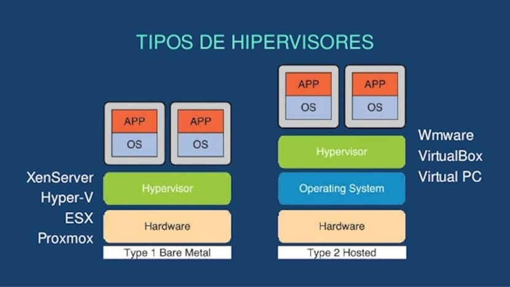
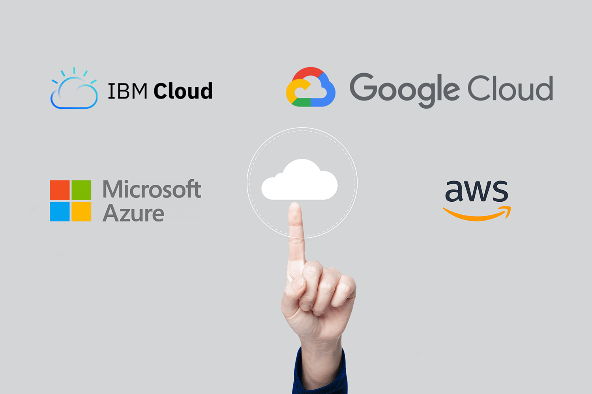
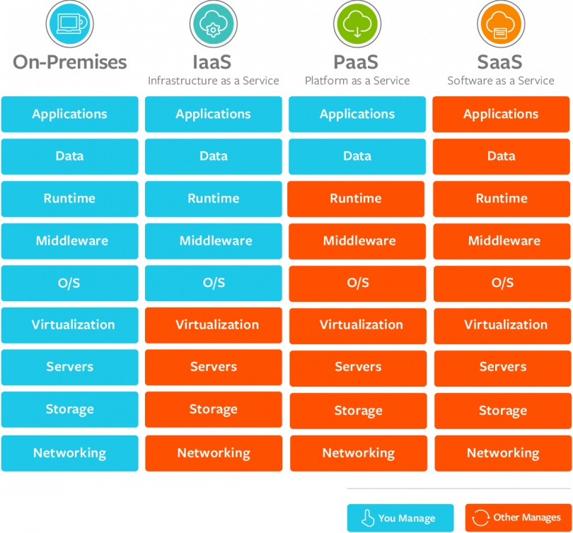

# Virtualizacion y Cloud Native

## 1. Virtualización

La virtualización es una tecnología clave en la computación moderna que permite la abstracción de recursos físicos y su partición en múltiples entornos virtuales. A continuación, se detalla cómo funciona, sus tipos y beneficios:

### ¿Cómo Funciona?

La virtualización se logra mediante un software conocido como "hipervisor" que se sitúa entre el hardware físico y los sistemas operativos que se ejecutan sobre él. El hipervisor puede ser de dos tipos:
- **Hipervisor de tipo 1 (bare-metal):** Corre directamente sobre el hardware físico y administra directamente los recursos del hardware. Ejemplos incluyen VMware ESXi, Microsoft Hyper-V y Xen.
- **Hipervisor de tipo 2 (hosted):** Corre sobre un sistema operativo y soporta la ejecución de máquinas virtuales como aplicaciones. Ejemplos incluyen VMware Workstation y Oracle VirtualBox.



### Tipos de Virtualización

1. **Virtualización de Servidores:** Permite que un solo servidor físico se divida en múltiples servidores virtuales, cada uno con su propio sistema operativo y aplicaciones.
2. **Virtualización de Escritorio:** Facilita la ejecución de sistemas operativos completos dentro de una máquina virtual, permitiendo acceso remoto y compartido a escritorios virtuales.
3. **Virtualización de Red:** Abstrae las funciones de la red para crear redes virtuales independientes del hardware subyacente.
4. **Virtualización de Almacenamiento:** Combina varios recursos de almacenamiento físico en un único dispositivo de almacenamiento virtualizado que puede ser gestionado de manera centralizada.
5. **Virtualización de Aplicaciones:** Permite que las aplicaciones se ejecuten en un entorno virtual que no depende del sistema operativo del hardware físico.

### Beneficios de la Virtualización

- **Eficiencia en el uso de recursos:** Maximiza la utilización del hardware físico.
- **Reducción de costos:** Disminuye la necesidad de hardware físico, reduciendo gastos de capital y operativos.
- **Flexibilidad:** Facilita la creación, copia, migración y eliminación de entornos virtuales.
- **Recuperación ante desastres:** Las copias de seguridad y restauración son más fáciles de gestionar en entornos virtualizados.
- **Escalabilidad:** Facilita el escalado de recursos según la demanda sin interrupciones significativas.

## 2. ¿Qué es Cloud Native?

El término "Cloud Native" describe una metodología moderna para construir y ejecutar aplicaciones que explotan completamente las ventajas del modelo de computación en la nube. Aquí se describen sus características clave, ventajas y componentes tecnológicos.

### Características Clave

1. **Microservicios:** Las aplicaciones Cloud Native suelen estar compuestas por microservicios, que son pequeñas piezas de funcionalidad autónoma que se comunican entre sí a través de APIs. Esto permite un desarrollo más rápido y ciclos de despliegue más cortos.

**Ejemplo:**
- **Sistema de Comercio Electrónico:** En lugar de tener una aplicación monolítica que maneje todos los aspectos (usuarios, productos, pagos, etc.), se podrían crear microservicios independientes:
  - **Servicio de Usuarios:** Maneja autenticación, registro, perfiles de usuario.
  - **Servicio de Productos:** Gestiona el catálogo de productos, inventario, etc.
  - **Servicio de Pagos:** Procesa transacciones, integración con pasarelas de pago.
  - **Servicio de Envíos:** Coordina la logística, seguimiento de envíos.

2. **Contenedores:** Los contenedores, como los que proporciona Docker, encapsulan una aplicación y sus dependencias en un solo paquete portátil, facilitando la consistencia y la escalabilidad en diferentes entornos de nube.

**Ejemplo:**
- **Despliegue de Aplicaciones en Contenedores:** Con un contenedor Docker, puedes ejecutar una aplicación web construida con Node.js de manera consistente en cualquier servidor compatible con Docker.

  ```Dockerfile
  FROM node:14
  WORKDIR /app
  COPY package*.json ./
  RUN npm install
  COPY . .
  EXPOSE 3000
  CMD ["node", "app.js"]
  ```

3. **Automatización Continua (CI/CD):** Las prácticas de integración continua y despliegue continuo son esenciales en Cloud Native, permitiendo a los desarrolladores integrar código, probar y desplegar aplicaciones de forma rápida y automática.

**Ejemplo:**

Pipeline CI/CD con Jenkins: Configura un pipeline que:
- CI: Ejecuta automáticamente pruebas unitarias al hacer un commit en un repositorio GitHub.
- CD: Construye una imagen Docker de la aplicación y la despliega en un clúster de Kubernetes.

4. **Escalabilidad Dinámica:** Las aplicaciones Cloud Native están diseñadas para escalar automáticamente en respuesta a la demanda, optimizando el uso de recursos y costes.

**Ejemplo:**

Autoescalado en Kubernetes: Kubernetes ajusta automáticamente la cantidad de pods según la utilización de CPU.

```yaml
apiVersion: autoscaling/v1
kind: HorizontalPodAutoscaler
metadata:
  name: my-app-hpa
spec:
  scaleTargetRef:
    apiVersion: apps/v1
    kind: Deployment
    name: my-app
  minReplicas: 2
  maxReplicas: 10
  targetCPUUtilizationPercentage: 80
```

5. **Resiliencia y Recuperación:** Estas aplicaciones están construidas para ser resilientes, lo que significa que pueden recuperarse rápidamente de fallos y mantenerse operativas.

**Ejemplo:**

Patrón Circuit Breaker: Implementa un Circuit Breaker para manejar fallos en el servicio de pago, proporcionando una respuesta alternativa si el servicio está caído.

```java
import org.springframework.cloud.client.circuitbreaker.CircuitBreakerFactory;
import org.springframework.stereotype.Service;

@Service
public class PaymentService {
    private final CircuitBreakerFactory circuitBreakerFactory;

    public PaymentService(CircuitBreakerFactory circuitBreakerFactory) {
        this.circuitBreakerFactory = circuitBreakerFactory;
    }

    public String processPayment() {
        return circuitBreakerFactory.create("paymentService").run(() -> {
            // Lógica para procesar el pago
            return "Payment Processed Successfully";
        }, throwable -> "Fallback: Payment Service Unavailable");
    }
}
```


### Ventajas

- **Rapidez en el desarrollo y despliegue:** Gracias a la modularidad y automatización, los equipos pueden iterar rápidamente y responder a las necesidades del mercado.
- **Escalabilidad y Flexibilidad:** Permite adaptar los recursos a la demanda en tiempo real, lo que es crítico para manejar cargas de trabajo variables.
- **Reducción de costos:** Se optimizan los recursos en la nube, utilizando solo lo que es necesario.
- **Portabilidad:** Al estar basadas en contenedores, las aplicaciones Cloud Native pueden moverse fácilmente entre diferentes entornos de nube sin reconfiguraciones significativas.
- **Resiliencia:** Diseñadas para fallos, con mecanismos integrados para la recuperación automática.

## 3. Proveedores de la Nube

Los proveedores de la nube ofrecen una variedad de servicios que permiten a las organizaciones alquilar recursos de computación en lugar de comprarlos y gestionarlos internamente. Aquí se describe a los principales proveedores y los tipos de servicios que ofrecen.

### Principales Proveedores de Nube

1. **Amazon Web Services (AWS):**
   - **Servicios destacados:** EC2 (computación), S3 (almacenamiento), RDS (bases de datos), Lambda (computación sin servidor), y SageMaker (aprendizaje automático).
   - **Fortalezas:** AWS es conocido por su amplia gama de servicios y su sólida infraestructura global.

2. **Microsoft Azure:**
   - **Servicios destacados:** Máquinas virtuales, Azure SQL Database, Azure Functions (sin servidor), y Azure DevOps.
   - **Fortalezas:** Integración nativa con productos Microsoft como Windows Server, Active Directory y Office 365.

3. **Google Cloud Platform (GCP):**
   - **Servicios destacados:** Compute Engine, Google Kubernetes Engine (GKE), BigQuery (análisis de datos), y TensorFlow (aprendizaje automático).
   - **Fortalezas:** GCP es conocido por su capacidad en análisis de datos y aprendizaje automático, y por su red privada de alta velocidad.

4. **IBM Cloud:**
   - **Servicios destacados:** IBM Watson (IA), IBM Blockchain, y servicios de computación cuántica.
   - **Fortalezas:** Especialización en IA, blockchain y soluciones empresariales complejas.

5. **Oracle Cloud:**
   - **Servicios destacados:** Oracle Autonomous Database, Oracle Cloud Infrastructure (OCI), y Oracle ERP Cloud.
   - **Fortalezas:** Fuerte enfoque en aplicaciones empresariales y bases de datos.



### Tipos de Servicios Ofrecidos

1. **Infraestructura como Servicio (IaaS):** Provisión de recursos de computación, como servidores virtuales y almacenamiento, que los usuarios pueden alquilar y gestionar según sus necesidades. Ejemplo: Amazon EC2, Google Compute Engine.
2. **Plataforma como Servicio (PaaS):** Provisión de una plataforma completa para el desarrollo, pruebas, y despliegue de aplicaciones sin preocuparse por la gestión del hardware subyacente. Ejemplo: AWS Elastic Beanstalk, Google App Engine.
3. **Software como Servicio (SaaS):** Provisión de aplicaciones listas para usar que están alojadas y gestionadas por el proveedor de la nube. Ejemplo: Microsoft Office 365, Google Workspace.



### Consideraciones al Elegir un Proveedor de Nube

- **Costo:** Evaluar los modelos de precios y costos a largo plazo.
- **Servicios ofrecidos:** Verificar que los servicios necesarios para la operación y desarrollo estén disponibles.
- **Soporte y Compliance:** Considerar las necesidades de soporte técnico y cumplimiento normativo.
- **Escalabilidad:** Evaluar la capacidad del proveedor para soportar el crecimiento futuro.
- **Integración:** Comprobar la facilidad de integración con los sistemas y aplicaciones existentes.
